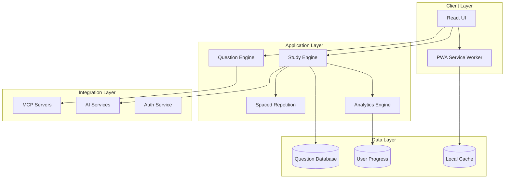
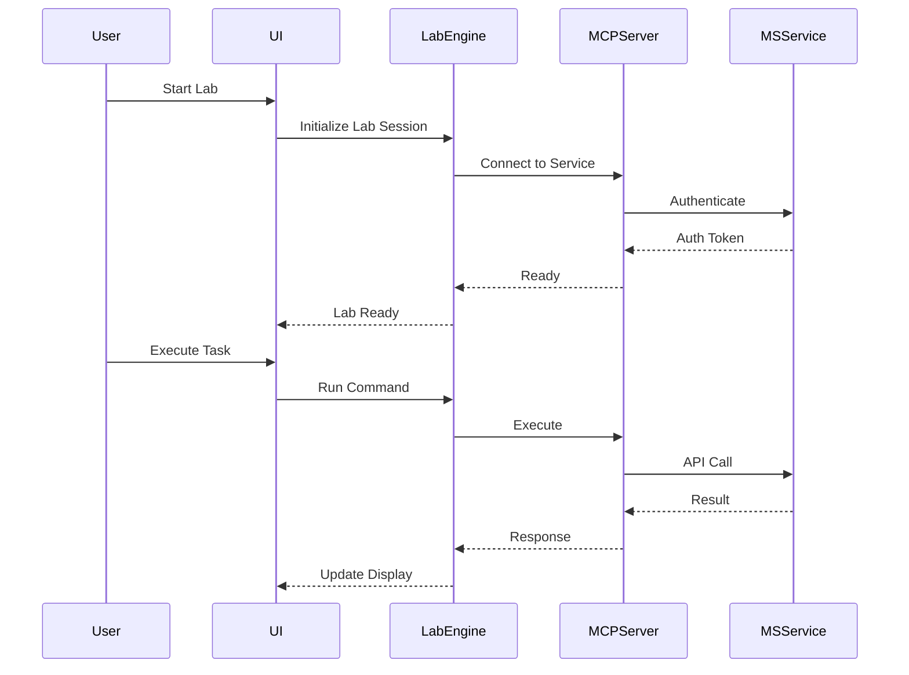
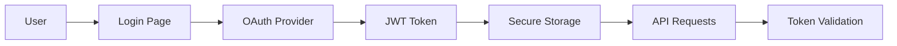

# Architecture Documentation

## 🏗️ System Architecture Overview

The PL-600 Exam Prep Platform is built as a modern, scalable web application using React with TypeScript, featuring MCP (Model Context Protocol) integrations for hands-on learning experiences.

## 📐 High-Level Architecture



## 🔧 Technology Stack

### Frontend
- **React 18**: Component-based UI framework
- **TypeScript 5**: Type-safe development
- **Vite**: Fast build tool and dev server
- **Tailwind CSS**: Utility-first styling
- **Redux Toolkit**: State management
- **React Query**: Server state management

### Testing
- **Jest**: Unit testing framework
- **React Testing Library**: Component testing
- **Playwright**: E2E testing
- **MSW**: API mocking

### Build & Deploy
- **GitHub Actions**: CI/CD pipeline
- **GitHub Pages**: Static hosting
- **Cloudflare**: CDN and edge caching

### MCP Integrations
- **Microsoft 365**: Power Platform hands-on labs
- **GitHub**: Version control and collaboration
- **Pieces**: Long-term memory and progress tracking
- **Obsidian**: Personal knowledge management

## 📦 Component Architecture

### Core Components

```typescript
// Component hierarchy
App
├── Router
│   ├── HomePage
│   ├── StudyPage
│   │   ├── QuestionDisplay
│   │   ├── AnswerOptions
│   │   └── ExplanationPanel
│   ├── DashboardPage
│   │   ├── ProgressChart
│   │   ├── WeakAreas
│   │   └── StudyPlan
│   └── LabsPage
│       ├── LabSelector
│       ├── LabWorkspace
│       └── LabResults
├── Navigation
└── GlobalProviders
```

### State Management

```typescript
// Redux store structure
store: {
  user: {
    profile: UserProfile,
    preferences: UserPreferences,
    subscription: SubscriptionStatus
  },
  study: {
    currentSession: StudySession,
    history: SessionHistory[],
    progress: ProgressMetrics
  },
  questions: {
    bank: Question[],
    filters: FilterState,
    currentQuestion: Question | null
  },
  analytics: {
    performance: PerformanceData,
    predictions: PredictionModel,
    recommendations: StudyRecommendations
  }
}
```

## 🧠 Core Algorithms

### Spaced Repetition Algorithm

```typescript
interface SpacedRepetitionParams {
  difficulty: number;        // 1-5 scale
  previousInterval: number;  // days
  performanceRating: number; // 0-1 scale
  consecutiveCorrect: number;
}

function calculateNextReview(params: SpacedRepetitionParams): number {
  const { difficulty, previousInterval, performanceRating, consecutiveCorrect } = params;
  
  // Base interval calculation
  let interval = previousInterval * 2.5;
  
  // Adjust for performance
  interval *= performanceRating;
  
  // Adjust for difficulty
  interval *= (1.3 - (difficulty * 0.1));
  
  // Bonus for streaks
  if (consecutiveCorrect > 3) {
    interval *= 1.2;
  }
  
  // Cap at reasonable limits
  return Math.min(Math.max(interval, 1), 180);
}
```

### Adaptive Learning Path

```typescript
interface AdaptiveLearningEngine {
  analyzePerformance(history: AttemptHistory[]): WeakAreas[];
  generatePath(weakAreas: WeakAreas[]): StudyPath;
  adjustDifficulty(performance: number): DifficultyLevel;
  predictReadiness(metrics: PerformanceMetrics): ReadinessScore;
}
```

## 🔌 MCP Integration Architecture

### MCP Client Manager

```typescript
class MCPManager {
  private servers: Map<string, MCPServer>;
  
  async initialize() {
    this.servers.set('microsoft365', new Microsoft365Server());
    this.servers.set('github', new GitHubServer());
    this.servers.set('pieces', new PiecesServer());
  }
  
  async executeLabCommand(server: string, command: string, params: any) {
    const mcpServer = this.servers.get(server);
    return await mcpServer.execute(command, params);
  }
}
```

### Lab Execution Flow



## 📊 Data Architecture

### Question Schema

```typescript
interface Question {
  id: string;
  version: string;
  questionText: string;
  questionType: 'multiple-choice' | 'hotspot' | 'drag-drop' | 'case-study';
  options: Option[];
  correctAnswer: string | string[];
  explanation: {
    correct: string;
    incorrect: Map<string, string>;
  };
  metadata: {
    examArea: 'envisioning' | 'architecture' | 'implementation';
    difficulty: 1 | 2 | 3 | 4 | 5;
    tags: string[];
    estimatedTime: number; // seconds
    lastUpdated: Date;
  };
  references: {
    microsoftLearnUrl?: string;
    documentationUrls?: string[];
    videoUrls?: string[];
  };
  statistics: {
    attempts: number;
    correctRate: number;
    averageTime: number;
  };
  community: {
    discussions: Discussion[];
    votes: VoteData;
    flags: Flag[];
  };
}
```

### User Progress Schema

```typescript
interface UserProgress {
  userId: string;
  examProgress: {
    totalQuestions: number;
    attemptedQuestions: number;
    correctAnswers: number;
    examAreas: {
      envisioning: AreaProgress;
      architecture: AreaProgress;
      implementation: AreaProgress;
    };
  };
  learningMetrics: {
    studyTime: number; // minutes
    streakDays: number;
    lastStudyDate: Date;
    velocity: number; // questions per hour
    retentionRate: number; // percentage
  };
  predictions: {
    readinessScore: number; // 0-100
    estimatedStudyHours: number;
    weakAreas: string[];
    recommendedFocusAreas: string[];
  };
}
```

## 🔒 Security Architecture

### Authentication Flow



### Security Measures

1. **Authentication**
   - OAuth 2.0 with PKCE flow
   - JWT tokens with short expiry
   - Refresh token rotation

2. **Data Protection**
   - Encrypted local storage
   - HTTPS-only communication
   - CSP headers configured

3. **API Security**
   - Rate limiting
   - Input validation
   - SQL injection prevention
   - XSS protection

## 🚀 Performance Optimization

### Loading Strategy

```typescript
// Lazy loading routes
const StudyPage = lazy(() => import('./pages/StudyPage'));
const LabsPage = lazy(() => import('./pages/LabsPage'));

// Code splitting by feature
const mcpIntegration = () => import('./features/mcpIntegration');
const analytics = () => import('./features/analytics');
```

### Caching Strategy

1. **Service Worker Caching**
   - Static assets cached indefinitely
   - API responses cached with TTL
   - Offline-first for questions

2. **Local Storage**
   - User progress synced periodically
   - Question attempts cached
   - Preferences stored locally

3. **CDN Strategy**
   - Static assets on Cloudflare
   - Regional edge caching
   - Image optimization

## 📱 Progressive Web App

### PWA Features

```javascript
// Service Worker Registration
if ('serviceWorker' in navigator) {
  navigator.serviceWorker.register('/sw.js')
    .then(registration => console.log('SW registered'))
    .catch(err => console.error('SW registration failed'));
}

// Offline Support
self.addEventListener('fetch', event => {
  event.respondWith(
    caches.match(event.request)
      .then(response => response || fetch(event.request))
  );
});
```

### Web App Manifest

```json
{
  "name": "PL-600 Exam Prep",
  "short_name": "PL600Prep",
  "start_url": "/",
  "display": "standalone",
  "theme_color": "#0078D4",
  "background_color": "#ffffff",
  "icons": [
    {
      "src": "/icon-192.png",
      "sizes": "192x192",
      "type": "image/png"
    }
  ]
}
```

## 🔄 Deployment Architecture

### CI/CD Pipeline

```yaml
# GitHub Actions workflow
name: Deploy
on:
  push:
    branches: [main]
jobs:
  build-and-deploy:
    runs-on: ubuntu-latest
    steps:
      - uses: actions/checkout@v3
      - uses: actions/setup-node@v3
      - run: npm ci
      - run: npm run build
      - run: npm test
      - uses: peaceiris/actions-gh-pages@v3
```

### Environment Configuration

```typescript
// Environment-specific configs
const config = {
  development: {
    apiUrl: 'http://localhost:3000',
    debug: true,
    mockData: true
  },
  production: {
    apiUrl: 'https://api.pl600prep.com',
    debug: false,
    mockData: false
  }
};
```

## 📈 Monitoring & Analytics

### Performance Monitoring

```typescript
// Web Vitals tracking
import { getCLS, getFID, getFCP, getLCP, getTTFB } from 'web-vitals';

function sendToAnalytics(metric) {
  // Send to analytics endpoint
  fetch('/analytics', {
    method: 'POST',
    body: JSON.stringify(metric)
  });
}

getCLS(sendToAnalytics);
getFID(sendToAnalytics);
getFCP(sendToAnalytics);
getLCP(sendToAnalytics);
getTTFB(sendToAnalytics);
```

### Error Tracking

```typescript
// Global error boundary
class ErrorBoundary extends React.Component {
  componentDidCatch(error, errorInfo) {
    console.error('Error caught:', error, errorInfo);
    // Send to error tracking service
    trackError(error, errorInfo);
  }
}
```

## 🔮 Future Architecture Considerations

1. **Microservices Migration**
   - Separate question service
   - Independent analytics service
   - Dedicated MCP gateway

2. **Real-time Features**
   - WebSocket for live collaboration
   - Real-time progress sync
   - Live study sessions

3. **Mobile Native Apps**
   - React Native implementation
   - Shared business logic
   - Platform-specific optimizations

4. **AI Enhancement**
   - Local LLM for explanations
   - Personalized learning models
   - Predictive analytics

---

This architecture is designed to be scalable, maintainable, and extensible, supporting the growth from MVP to a full-featured platform serving thousands of users.