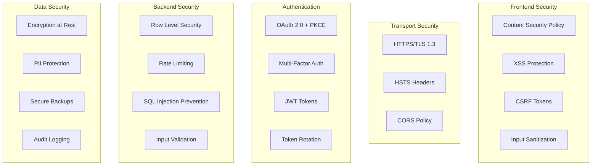

# 🔒 Security Architecture & Implementation Guide

## Overview

This document outlines the comprehensive security measures implemented in the PL-600 Exam Prep Platform to protect user data, prevent unauthorized access, and ensure compliance with security best practices.

## 🛡️ Security Layers



## 🔐 Authentication & Authorization

### OAuth 2.0 with PKCE Implementation

```typescript
// src/lib/auth/oauth.ts
import { supabase } from '@/lib/supabase';
import crypto from 'crypto';

class OAuthManager {
  private codeVerifier: string;
  private codeChallenge: string;
  
  constructor() {
    // Generate PKCE parameters
    this.codeVerifier = this.generateCodeVerifier();
    this.codeChallenge = this.generateCodeChallenge(this.codeVerifier);
  }
  
  private generateCodeVerifier(): string {
    return crypto.randomBytes(32).toString('base64url');
  }
  
  private generateCodeChallenge(verifier: string): string {
    return crypto
      .createHash('sha256')
      .update(verifier)
      .digest('base64url');
  }
  
  async signInWithMicrosoft() {
    const { data, error } = await supabase.auth.signInWithOAuth({
      provider: 'azure',
      options: {
        scopes: 'email profile',
        queryParams: {
          code_challenge: this.codeChallenge,
          code_challenge_method: 'S256',
        },
        redirectTo: `${window.location.origin}/auth/callback`,
      }
    });
    
    if (error) throw new SecurityError('OAuth authentication failed', error);
    
    // Store code verifier securely
    sessionStorage.setItem('pkce_verifier', this.codeVerifier);
    
    return data;
  }
  
  async handleCallback(code: string) {
    const verifier = sessionStorage.getItem('pkce_verifier');
    if (!verifier) throw new SecurityError('PKCE verifier not found');
    
    const { data, error } = await supabase.auth.exchangeCodeForSession(code);
    
    // Clear sensitive data
    sessionStorage.removeItem('pkce_verifier');
    
    if (error) throw new SecurityError('Token exchange failed', error);
    
    return data;
  }
}
```

### JWT Token Security

```typescript
// src/lib/auth/tokenManager.ts
class TokenManager {
  private readonly TOKEN_EXPIRY = 15 * 60 * 1000; // 15 minutes
  private readonly REFRESH_THRESHOLD = 5 * 60 * 1000; // 5 minutes before expiry
  
  async validateToken(token: string): Promise<boolean> {
    try {
      const payload = this.decodeJWT(token);
      
      // Check expiration
      if (Date.now() >= payload.exp * 1000) {
        return false;
      }
      
      // Check issuer
      if (payload.iss !== import.meta.env.VITE_SUPABASE_URL) {
        return false;
      }
      
      // Check audience
      if (payload.aud !== 'authenticated') {
        return false;
      }
      
      return true;
    } catch {
      return false;
    }
  }
  
  private decodeJWT(token: string) {
    const parts = token.split('.');
    if (parts.length !== 3) throw new Error('Invalid JWT');
    
    return JSON.parse(atob(parts[1]));
  }
  
  async refreshTokenIfNeeded() {
    const session = await supabase.auth.getSession();
    if (!session.data.session) return;
    
    const expiresAt = session.data.session.expires_at * 1000;
    const shouldRefresh = expiresAt - Date.now() < this.REFRESH_THRESHOLD;
    
    if (shouldRefresh) {
      const { error } = await supabase.auth.refreshSession();
      if (error) throw new SecurityError('Token refresh failed', error);
    }
  }
}
```

### Multi-Factor Authentication

```typescript
// src/lib/auth/mfa.ts
class MFAManager {
  async enrollTOTP(userId: string) {
    const { data, error } = await supabase.auth.mfa.enroll({
      factorType: 'totp',
      friendlyName: 'PL-600 Exam Prep'
    });
    
    if (error) throw error;
    
    // Return QR code for user to scan
    return {
      qrCode: data.totp.qr_code,
      secret: data.totp.secret,
      id: data.id
    };
  }
  
  async verifyTOTP(factorId: string, code: string) {
    const { data, error } = await supabase.auth.mfa.verify({
      factorId,
      code
    });
    
    if (error) throw new SecurityError('MFA verification failed');
    
    return data;
  }
  
  async challengeMFA() {
    const { data, error } = await supabase.auth.mfa.challenge({
      factorId: 'all'
    });
    
    if (error) throw error;
    
    return data;
  }
}
```

## 🛡️ Frontend Security

### Content Security Policy (CSP)

```typescript
// src/security/csp.ts
export const CSP_POLICY = {
  'default-src': ["'self'"],
  'script-src': [
    "'self'",
    "'unsafe-inline'", // Required for React
    "https://cdn.jsdelivr.net", // CDN scripts
    "https://*.supabase.co" // Supabase
  ],
  'style-src': [
    "'self'",
    "'unsafe-inline'", // Required for Tailwind
    "https://fonts.googleapis.com"
  ],
  'font-src': [
    "'self'",
    "https://fonts.gstatic.com"
  ],
  'img-src': [
    "'self'",
    "data:",
    "https://*.supabase.co", // Supabase storage
    "https://avatars.githubusercontent.com" // GitHub avatars
  ],
  'connect-src': [
    "'self'",
    "https://*.supabase.co", // Supabase API
    "wss://*.supabase.co", // Supabase realtime
    "https://api.github.com", // GitHub MCP
    "https://graph.microsoft.com" // Microsoft MCP
  ],
  'frame-ancestors': ["'none'"],
  'form-action': ["'self'"],
  'base-uri': ["'self'"],
  'object-src': ["'none'"],
  'upgrade-insecure-requests': true
};

// Apply CSP headers
export function applyCSP() {
  const policy = Object.entries(CSP_POLICY)
    .map(([key, values]) => {
      if (typeof values === 'boolean') return key;
      return `${key} ${values.join(' ')}`;
    })
    .join('; ');
  
  const meta = document.createElement('meta');
  meta.httpEquiv = 'Content-Security-Policy';
  meta.content = policy;
  document.head.appendChild(meta);
}
```

### XSS Protection

```typescript
// src/security/sanitizer.ts
import DOMPurify from 'isomorphic-dompurify';

export class Sanitizer {
  static sanitizeHTML(dirty: string): string {
    return DOMPurify.sanitize(dirty, {
      ALLOWED_TAGS: ['b', 'i', 'em', 'strong', 'a', 'p', 'br', 'ul', 'li', 'ol'],
      ALLOWED_ATTR: ['href', 'target', 'rel'],
      ALLOW_DATA_ATTR: false,
      ADD_ATTR: ['rel="noopener noreferrer"', 'target="_blank"']
    });
  }
  
  static sanitizeInput(input: string): string {
    // Remove any HTML tags
    const cleaned = input.replace(/<[^>]*>/g, '');
    
    // Escape special characters
    return cleaned
      .replace(/&/g, '&amp;')
      .replace(/</g, '&lt;')
      .replace(/>/g, '&gt;')
      .replace(/"/g, '&quot;')
      .replace(/'/g, '&#x27;')
      .replace(/\//g, '&#x2F;');
  }
  
  static sanitizeSQL(input: string): string {
    // Remove SQL keywords and special characters
    return input
      .replace(/(\b(SELECT|INSERT|UPDATE|DELETE|DROP|UNION|WHERE|FROM)\b)/gi, '')
      .replace(/[;'"\\]/g, '');
  }
}
```

### CSRF Protection

```typescript
// src/security/csrf.ts
class CSRFManager {
  private token: string | null = null;
  
  generateToken(): string {
    const array = new Uint8Array(32);
    crypto.getRandomValues(array);
    this.token = btoa(String.fromCharCode(...array));
    
    // Store in secure cookie
    document.cookie = `csrf_token=${this.token}; SameSite=Strict; Secure; HttpOnly`;
    
    return this.token;
  }
  
  validateToken(token: string): boolean {
    const cookieToken = this.getTokenFromCookie();
    return token === cookieToken && token === this.token;
  }
  
  private getTokenFromCookie(): string | null {
    const match = document.cookie.match(/csrf_token=([^;]+)/);
    return match ? match[1] : null;
  }
  
  attachToRequest(request: RequestInit): RequestInit {
    if (!this.token) this.generateToken();
    
    return {
      ...request,
      headers: {
        ...request.headers,
        'X-CSRF-Token': this.token!
      }
    };
  }
}
```

## 🔒 Backend Security

### Row Level Security (RLS) Policies

```sql
-- Complete RLS implementation for all tables

-- Enable RLS on all tables
ALTER TABLE user_profiles ENABLE ROW LEVEL SECURITY;
ALTER TABLE user_progress ENABLE ROW LEVEL SECURITY;
ALTER TABLE study_sessions ENABLE ROW LEVEL SECURITY;
ALTER TABLE spaced_repetition ENABLE ROW LEVEL SECURITY;
ALTER TABLE question_discussions ENABLE ROW LEVEL SECURITY;
ALTER TABLE user_questions ENABLE ROW LEVEL SECURITY;
ALTER TABLE lab_attempts ENABLE ROW LEVEL SECURITY;
ALTER TABLE analytics_events ENABLE ROW LEVEL SECURITY;

-- User Profiles: Users can only access their own profile
CREATE POLICY "users_own_profile_select" ON user_profiles
  FOR SELECT USING (auth.uid() = id);

CREATE POLICY "users_own_profile_update" ON user_profiles
  FOR UPDATE USING (auth.uid() = id)
  WITH CHECK (auth.uid() = id);

CREATE POLICY "users_own_profile_insert" ON user_profiles
  FOR INSERT WITH CHECK (auth.uid() = id);

-- User Progress: Complete isolation
CREATE POLICY "users_own_progress" ON user_progress
  FOR ALL USING (auth.uid() = user_id)
  WITH CHECK (auth.uid() = user_id);

-- Study Sessions: User-specific with no cross-access
CREATE POLICY "users_own_sessions" ON study_sessions
  FOR ALL USING (auth.uid() = user_id)
  WITH CHECK (auth.uid() = user_id);

-- Spaced Repetition: Personal learning data
CREATE POLICY "users_own_repetition" ON spaced_repetition
  FOR ALL USING (auth.uid() = user_id)
  WITH CHECK (auth.uid() = user_id);

-- Question Discussions: Public read, authenticated write
CREATE POLICY "public_read_discussions" ON question_discussions
  FOR SELECT USING (true);

CREATE POLICY "authenticated_write_discussions" ON question_discussions
  FOR INSERT WITH CHECK (auth.uid() IS NOT NULL AND auth.uid() = user_id);

CREATE POLICY "users_edit_own_discussions" ON question_discussions
  FOR UPDATE USING (auth.uid() = user_id)
  WITH CHECK (auth.uid() = user_id);

CREATE POLICY "users_delete_own_discussions" ON question_discussions
  FOR DELETE USING (auth.uid() = user_id);

-- Lab Attempts: User-specific lab data
CREATE POLICY "users_own_labs" ON lab_attempts
  FOR ALL USING (auth.uid() = user_id)
  WITH CHECK (auth.uid() = user_id);

-- Analytics Events: Write-only for users, read for admins
CREATE POLICY "users_write_analytics" ON analytics_events
  FOR INSERT WITH CHECK (auth.uid() = user_id);

-- Admin policies (separate admin check)
CREATE POLICY "admin_read_all" ON analytics_events
  FOR SELECT USING (
    EXISTS (
      SELECT 1 FROM user_profiles
      WHERE id = auth.uid() AND subscription_tier = 'admin'
    )
  );
```

### Rate Limiting Implementation

```typescript
// src/security/rateLimiter.ts
interface RateLimitConfig {
  windowMs: number;
  maxRequests: number;
  keyGenerator: (req: Request) => string;
}

class RateLimiter {
  private requests: Map<string, number[]> = new Map();
  
  constructor(private config: RateLimitConfig) {}
  
  async checkLimit(request: Request): Promise<boolean> {
    const key = this.config.keyGenerator(request);
    const now = Date.now();
    const windowStart = now - this.config.windowMs;
    
    // Get existing requests for this key
    let timestamps = this.requests.get(key) || [];
    
    // Filter out old requests
    timestamps = timestamps.filter(t => t > windowStart);
    
    // Check if limit exceeded
    if (timestamps.length >= this.config.maxRequests) {
      throw new RateLimitError(
        `Rate limit exceeded. Max ${this.config.maxRequests} requests per ${this.config.windowMs}ms`
      );
    }
    
    // Add current request
    timestamps.push(now);
    this.requests.set(key, timestamps);
    
    // Clean up old entries periodically
    this.cleanup();
    
    return true;
  }
  
  private cleanup() {
    const now = Date.now();
    const windowStart = now - this.config.windowMs;
    
    for (const [key, timestamps] of this.requests.entries()) {
      const valid = timestamps.filter(t => t > windowStart);
      if (valid.length === 0) {
        this.requests.delete(key);
      } else {
        this.requests.set(key, valid);
      }
    }
  }
}

// Rate limit configurations
export const rateLimiters = {
  api: new RateLimiter({
    windowMs: 60000, // 1 minute
    maxRequests: 100,
    keyGenerator: (req) => req.headers.get('x-user-id') || 'anonymous'
  }),
  
  auth: new RateLimiter({
    windowMs: 900000, // 15 minutes
    maxRequests: 5,
    keyGenerator: (req) => req.headers.get('x-forwarded-for') || 'unknown'
  }),
  
  expensive: new RateLimiter({
    windowMs: 3600000, // 1 hour
    maxRequests: 10,
    keyGenerator: (req) => req.headers.get('x-user-id') || 'anonymous'
  })
};
```

### Input Validation

```typescript
// src/security/validator.ts
import { z } from 'zod';

// Schema definitions
const schemas = {
  userProfile: z.object({
    display_name: z.string().min(1).max(100).regex(/^[a-zA-Z0-9\s-_]+$/),
    avatar_url: z.string().url().optional(),
    study_goal: z.string().max(500).optional(),
    target_exam_date: z.date().min(new Date()).optional()
  }),
  
  questionAnswer: z.object({
    question_id: z.string().uuid(),
    answer: z.union([z.string(), z.array(z.string())]),
    time_spent: z.number().min(0).max(3600),
    confidence_level: z.number().min(1).max(5).optional()
  }),
  
  discussion: z.object({
    question_id: z.string().uuid(),
    content: z.string().min(1).max(5000),
    parent_id: z.string().uuid().optional()
  }),
  
  labAttempt: z.object({
    lab_id: z.string().regex(/^LAB-\d{3}$/),
    mcp_server: z.enum(['microsoft365', 'github', 'azuredevops']),
    metadata: z.record(z.unknown()).optional()
  })
};

export class Validator {
  static validate<T>(schema: keyof typeof schemas, data: unknown): T {
    try {
      return schemas[schema].parse(data) as T;
    } catch (error) {
      if (error instanceof z.ZodError) {
        throw new ValidationError('Validation failed', error.errors);
      }
      throw error;
    }
  }
  
  static sanitizeFileName(filename: string): string {
    // Remove path traversal attempts
    return filename
      .replace(/\.\./g, '')
      .replace(/[\/\\]/g, '')
      .replace(/^\./, '')
      .substring(0, 255);
  }
  
  static isValidEmail(email: string): boolean {
    const emailRegex = /^[^\s@]+@[^\s@]+\.[^\s@]+$/;
    return emailRegex.test(email) && email.length <= 254;
  }
  
  static isStrongPassword(password: string): boolean {
    // At least 8 chars, 1 uppercase, 1 lowercase, 1 number, 1 special char
    const strongRegex = /^(?=.*[a-z])(?=.*[A-Z])(?=.*\d)(?=.*[@$!%*?&])[A-Za-z\d@$!%*?&]{8,}$/;
    return strongRegex.test(password);
  }
}
```

## 🔐 Data Security

### Encryption Implementation

```typescript
// src/security/encryption.ts
import { createCipheriv, createDecipheriv, randomBytes, scrypt } from 'crypto';
import { promisify } from 'util';

const scryptAsync = promisify(scrypt);

export class Encryption {
  private readonly algorithm = 'aes-256-gcm';
  private readonly saltLength = 32;
  private readonly tagLength = 16;
  private readonly ivLength = 16;
  
  async encrypt(text: string, password: string): Promise<string> {
    const salt = randomBytes(this.saltLength);
    const iv = randomBytes(this.ivLength);
    
    const key = await this.deriveKey(password, salt);
    const cipher = createCipheriv(this.algorithm, key, iv);
    
    const encrypted = Buffer.concat([
      cipher.update(text, 'utf8'),
      cipher.final()
    ]);
    
    const tag = cipher.getAuthTag();
    
    // Combine salt, iv, tag, and encrypted data
    const combined = Buffer.concat([salt, iv, tag, encrypted]);
    
    return combined.toString('base64');
  }
  
  async decrypt(encryptedData: string, password: string): Promise<string> {
    const combined = Buffer.from(encryptedData, 'base64');
    
    // Extract components
    const salt = combined.slice(0, this.saltLength);
    const iv = combined.slice(this.saltLength, this.saltLength + this.ivLength);
    const tag = combined.slice(
      this.saltLength + this.ivLength,
      this.saltLength + this.ivLength + this.tagLength
    );
    const encrypted = combined.slice(this.saltLength + this.ivLength + this.tagLength);
    
    const key = await this.deriveKey(password, salt);
    const decipher = createDecipheriv(this.algorithm, key, iv);
    decipher.setAuthTag(tag);
    
    const decrypted = Buffer.concat([
      decipher.update(encrypted),
      decipher.final()
    ]);
    
    return decrypted.toString('utf8');
  }
  
  private async deriveKey(password: string, salt: Buffer): Promise<Buffer> {
    return (await scryptAsync(password, salt, 32)) as Buffer;
  }
  
  // PII field encryption
  async encryptPII(data: any): Promise<any> {
    const piiFields = ['email', 'phone', 'address', 'ssn', 'creditCard'];
    const encrypted = { ...data };
    
    for (const field of piiFields) {
      if (encrypted[field]) {
        encrypted[field] = await this.encrypt(
          encrypted[field],
          process.env.PII_ENCRYPTION_KEY!
        );
      }
    }
    
    return encrypted;
  }
}
```

### Audit Logging

```typescript
// src/security/auditLogger.ts
interface AuditLog {
  timestamp: Date;
  userId: string;
  action: string;
  resource: string;
  ip: string;
  userAgent: string;
  success: boolean;
  metadata?: Record<string, any>;
}

class AuditLogger {
  private queue: AuditLog[] = [];
  private flushInterval = 5000; // 5 seconds
  
  constructor() {
    setInterval(() => this.flush(), this.flushInterval);
  }
  
  log(entry: Omit<AuditLog, 'timestamp'>): void {
    this.queue.push({
      ...entry,
      timestamp: new Date()
    });
    
    // Immediate flush for critical events
    if (this.isCriticalEvent(entry.action)) {
      this.flush();
    }
  }
  
  private isCriticalEvent(action: string): boolean {
    const critical = [
      'login_failed',
      'password_reset',
      'permission_change',
      'data_export',
      'account_deletion',
      'admin_action'
    ];
    return critical.includes(action);
  }
  
  private async flush(): Promise<void> {
    if (this.queue.length === 0) return;
    
    const logs = [...this.queue];
    this.queue = [];
    
    try {
      await supabase
        .from('audit_logs')
        .insert(logs);
    } catch (error) {
      console.error('Failed to flush audit logs:', error);
      // Re-queue failed logs
      this.queue.unshift(...logs);
    }
  }
  
  // Query audit logs
  async query(filters: {
    userId?: string;
    action?: string;
    startDate?: Date;
    endDate?: Date;
    success?: boolean;
  }): Promise<AuditLog[]> {
    let query = supabase
      .from('audit_logs')
      .select('*');
    
    if (filters.userId) query = query.eq('userId', filters.userId);
    if (filters.action) query = query.eq('action', filters.action);
    if (filters.success !== undefined) query = query.eq('success', filters.success);
    if (filters.startDate) query = query.gte('timestamp', filters.startDate.toISOString());
    if (filters.endDate) query = query.lte('timestamp', filters.endDate.toISOString());
    
    const { data, error } = await query;
    
    if (error) throw error;
    return data;
  }
}

export const auditLogger = new AuditLogger();
```

## 🚨 Security Monitoring

### Real-time Threat Detection

```typescript
// src/security/threatDetection.ts
class ThreatDetector {
  private readonly thresholds = {
    failedLogins: 5,
    requestsPerMinute: 100,
    suspiciousPatterns: [
      /(\b(SELECT|INSERT|UPDATE|DELETE|DROP)\b)/i,
      /<script[^>]*>/i,
      /javascript:/i,
      /on\w+\s*=/i
    ]
  };
  
  async detectThreats(request: Request): Promise<ThreatLevel> {
    const threats: string[] = [];
    
    // Check for SQL injection attempts
    if (this.detectSQLInjection(request)) {
      threats.push('SQL_INJECTION');
    }
    
    // Check for XSS attempts
    if (this.detectXSS(request)) {
      threats.push('XSS_ATTEMPT');
    }
    
    // Check for brute force
    if (await this.detectBruteForce(request)) {
      threats.push('BRUTE_FORCE');
    }
    
    // Check for path traversal
    if (this.detectPathTraversal(request)) {
      threats.push('PATH_TRAVERSAL');
    }
    
    // Log threats
    if (threats.length > 0) {
      auditLogger.log({
        userId: request.headers.get('x-user-id') || 'unknown',
        action: 'threat_detected',
        resource: request.url,
        ip: request.headers.get('x-forwarded-for') || 'unknown',
        userAgent: request.headers.get('user-agent') || 'unknown',
        success: false,
        metadata: { threats }
      });
    }
    
    return this.calculateThreatLevel(threats);
  }
  
  private detectSQLInjection(request: Request): boolean {
    const url = new URL(request.url);
    const params = url.searchParams.toString();
    const body = request.body?.toString() || '';
    
    const content = params + body;
    return this.thresholds.suspiciousPatterns[0].test(content);
  }
  
  private detectXSS(request: Request): boolean {
    const url = new URL(request.url);
    const params = url.searchParams.toString();
    const body = request.body?.toString() || '';
    
    const content = params + body;
    return this.thresholds.suspiciousPatterns.slice(1).some(
      pattern => pattern.test(content)
    );
  }
  
  private async detectBruteForce(request: Request): Promise<boolean> {
    const ip = request.headers.get('x-forwarded-for') || 'unknown';
    const endpoint = new URL(request.url).pathname;
    
    if (endpoint.includes('/auth/login')) {
      const recentAttempts = await auditLogger.query({
        action: 'login_failed',
        startDate: new Date(Date.now() - 900000), // Last 15 minutes
        success: false
      });
      
      const ipAttempts = recentAttempts.filter(log => log.ip === ip);
      return ipAttempts.length >= this.thresholds.failedLogins;
    }
    
    return false;
  }
  
  private detectPathTraversal(request: Request): boolean {
    const url = new URL(request.url);
    return url.pathname.includes('../') || url.pathname.includes('..\\');
  }
  
  private calculateThreatLevel(threats: string[]): ThreatLevel {
    if (threats.length === 0) return 'none';
    if (threats.length === 1) return 'low';
    if (threats.length === 2) return 'medium';
    return 'high';
  }
}

type ThreatLevel = 'none' | 'low' | 'medium' | 'high';
```

## 🔧 Security Headers

```typescript
// src/security/headers.ts
export const SECURITY_HEADERS = {
  'Strict-Transport-Security': 'max-age=31536000; includeSubDomains; preload',
  'X-Content-Type-Options': 'nosniff',
  'X-Frame-Options': 'DENY',
  'X-XSS-Protection': '1; mode=block',
  'Referrer-Policy': 'strict-origin-when-cross-origin',
  'Permissions-Policy': 'camera=(), microphone=(), geolocation=()',
  'Cross-Origin-Opener-Policy': 'same-origin',
  'Cross-Origin-Resource-Policy': 'same-origin',
  'Cross-Origin-Embedder-Policy': 'require-corp'
};

// Vite config for security headers
export const viteSecurityPlugin = () => ({
  name: 'security-headers',
  configureServer(server: any) {
    server.middlewares.use((req: any, res: any, next: any) => {
      Object.entries(SECURITY_HEADERS).forEach(([key, value]) => {
        res.setHeader(key, value);
      });
      next();
    });
  }
});
```

## 🛠️ Security Testing

```typescript
// tests/security/security.test.ts
import { describe, it, expect } from 'vitest';
import { Sanitizer } from '@/security/sanitizer';
import { Validator } from '@/security/validator';
import { Encryption } from '@/security/encryption';

describe('Security Tests', () => {
  describe('XSS Prevention', () => {
    it('should sanitize HTML input', () => {
      const dirty = '<script>alert("XSS")</script><p>Hello</p>';
      const clean = Sanitizer.sanitizeHTML(dirty);
      expect(clean).toBe('<p>Hello</p>');
    });
    
    it('should escape special characters', () => {
      const input = '<script>alert("test")</script>';
      const escaped = Sanitizer.sanitizeInput(input);
      expect(escaped).not.toContain('<script>');
    });
  });
  
  describe('SQL Injection Prevention', () => {
    it('should remove SQL keywords', () => {
      const input = 'SELECT * FROM users WHERE id = 1';
      const sanitized = Sanitizer.sanitizeSQL(input);
      expect(sanitized).not.toContain('SELECT');
      expect(sanitized).not.toContain('FROM');
    });
  });
  
  describe('Input Validation', () => {
    it('should validate email format', () => {
      expect(Validator.isValidEmail('test@example.com')).toBe(true);
      expect(Validator.isValidEmail('invalid-email')).toBe(false);
    });
    
    it('should validate strong passwords', () => {
      expect(Validator.isStrongPassword('Weak123')).toBe(false);
      expect(Validator.isStrongPassword('Str0ng!Pass')).toBe(true);
    });
  });
  
  describe('Encryption', () => {
    it('should encrypt and decrypt data correctly', async () => {
      const encryption = new Encryption();
      const plaintext = 'sensitive data';
      const password = 'test-password';
      
      const encrypted = await encryption.encrypt(plaintext, password);
      const decrypted = await encryption.decrypt(encrypted, password);
      
      expect(decrypted).toBe(plaintext);
      expect(encrypted).not.toBe(plaintext);
    });
  });
});
```

## 📋 Security Checklist

### Development Phase
- [ ] All dependencies scanned for vulnerabilities (`npm audit`)
- [ ] Environment variables properly secured
- [ ] No hardcoded secrets in code
- [ ] Input validation on all user inputs
- [ ] Output encoding for all dynamic content
- [ ] HTTPS enforced in all environments
- [ ] Security headers configured
- [ ] Rate limiting implemented
- [ ] Authentication properly implemented
- [ ] Authorization checks on all endpoints

### Pre-Deployment
- [ ] Security testing completed
- [ ] Penetration testing performed
- [ ] OWASP Top 10 vulnerabilities checked
- [ ] SSL/TLS certificate valid
- [ ] Backup and recovery tested
- [ ] Incident response plan documented
- [ ] Security monitoring configured
- [ ] Audit logging enabled
- [ ] Data encryption verified

### Production
- [ ] Regular security updates applied
- [ ] Security patches monitored
- [ ] Access logs reviewed regularly
- [ ] Anomaly detection active
- [ ] Security metrics tracked
- [ ] Compliance requirements met
- [ ] Data retention policies enforced
- [ ] Regular security audits scheduled

## 🚨 Incident Response

### Security Incident Procedure
1. **Detection**: Automated monitoring or user report
2. **Containment**: Isolate affected systems
3. **Investigation**: Analyze logs and identify root cause
4. **Eradication**: Remove threat and patch vulnerability
5. **Recovery**: Restore normal operations
6. **Lessons Learned**: Document and improve

### Contact Information
- Security Team: security@pl600prep.com
- Incident Hotline: +1-XXX-XXX-XXXX
- Bug Bounty: security.txt

## 📚 Security Resources

- [OWASP Top 10](https://owasp.org/www-project-top-ten/)
- [NIST Cybersecurity Framework](https://www.nist.gov/cyberframework)
- [CWE Top 25](https://cwe.mitre.org/top25/)
- [Security Best Practices](https://cheatsheetseries.owasp.org/)

---

*Security is not a feature, it's a requirement. This document is regularly updated to address new threats and vulnerabilities.*